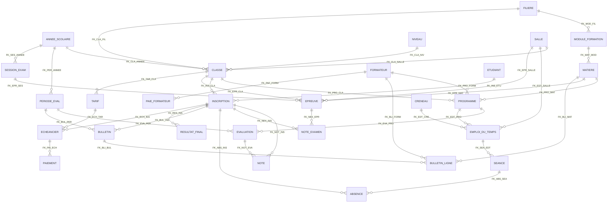

# Analyse de la base `LTA_ADM.accdb` — modèle métier LTA (BTS Hôtellerie & Tourisme)

> **Périmètre de ce document** : analyse complète de la base existante et de `LISEZ_MOI.md`, préalable au
> développement des écrans. **Aucune modification de la base**, **aucun CRUD ajouté** à cette étape.
>
> **Méthode** : la base a été lue directement au format binaire (le fichier est un conteneur
> *Standard ACE DB*, 1 064 960 octets = 260 pages de 4 096 octets, en-tête `jet_version = 2` → moteur ACE
> Access 2007+). Le catalogue (`MSysObjects`), les tables, les index (drapeaux et colonnes),
> les relations (`MSysRelationships`), les requêtes enregistrées (`MSysQueries`, 174 lignes décodées),
> le projet VBA (`MSysAccessStorage` + flux `dir` compressé MS-OVBA) et les propriétés de champs
> (`MSysObjects.LvProp`) ont été extraits page par page. Les fichiers bruts sont dans `analysis/`
> (`schema_tables.txt`, `donnees_initiales.txt`, `requetes_access.sql`, `extraction_complete.json`).
>
> `LTA_ADM.accdb` est intact : `git status` ne montre aucune modification du fichier, seulement l'ajout
> du dossier `analysis/` et de ce rapport.

---

## Chiffres clés vérifiés

| Mesure | Valeur |
|---|---|
| Tables métier | **33** |
| Colonnes au total | **267** |
| Relations (clés étrangères) utilisateur | **40** |
| Clés primaires | 33 (26 sur AutoNumber, **7 sur clé naturelle**) |
| Index uniques « métier » hors PK | **7** |
| Requêtes Access enregistrées | **8** (toutes décodées) |
| Modules VBA dans la base | **0** (voir §7) |
| Formulaires / États Access | **0** |
| Colonnes déclarées **NOT NULL / Obligatoire** | **0** |
| Valeurs par défaut / règles de validation / descriptions stockées | **0** |
| Tables peuplées / vides | **13 / 20** |

Répartition des 267 colonnes : TEXT 110 · LONG 79 · DOUBLE 27 · DATETIME 26 · BOOLEAN 16 · CURRENCY 7 · MEMO 2.

---

## 1. Le schéma fonctionnel

### 1.1 Organisation en 9 blocs

| Bloc | Tables | Rôle |
|---|---|---|
| **Administration** | `UTILISATEUR`, `PARAMETRE`, `ETABLISSEMENT`, `ANNEE_SCOLAIRE`, `JOURNAL` | comptes, règles de gestion, identité de l'établissement, année courante, traçabilité |
| **Référentiel** | `FILIERE`, `NIVEAU`, `SALLE`, `CLASSE`, `MODULE_FORMATION`, `MATIERE` | nomenclatures stables |
| **Personnel** | `FORMATEUR`, `PROGRAMME` | enseignants et affectations classe × matière × formateur × coefficient |
| **Étudiants** | `ETUDIANT`, `INSCRIPTION` | dossier personne + 1 ligne d'inscription par classe (historique, redoublement) |
| **Évaluations (CC)** | `PERIODE_EVAL`, `EVALUATION`, `NOTE` | périodes dynamiques, devoirs barémés/pondérés, notes par étudiant |
| **Examens** | `SESSION_EXAM`, `EPREUVE`, `NOTE_EXAMEN` | sessions, épreuves planifiées, notes d'examen |
| **Emploi du temps** | `CRENEAU`, `EMPLOI_DU_TEMPS`, `SEANCE`, `ABSENCE` | créneaux, slots hebdomadaires, cahier de texte daté, absences |
| **Bulletins / résultats** | `BULLETIN`, `BULLETIN_LIGNE`, `GRILLE_MENTION`, `RESULTAT_FINAL` | bulletins par période, lignes matières, barème de mentions, décision de fin d'année |
| **Écolage & paie** | `TARIF`, `ECHEANCIER`, `PAIEMENT`, `PAIE_FORMATEUR` | tarifs par classe, tranches, encaissements, rémunération horaire |

### 1.2 Diagramme entité-association

### 1.3 Inventaire détaillé des tables

Légende : 🔢 = AutoNumber · **G** = clé primaire · U = index unique.

**Administration**

| Table | Colonne | Type | Notes |
|---|---|---|---|
| `UTILISATEUR` (3 l.) | **CODE_UTR** | TEXT 40 | clé naturelle |
| | NOM_UTR / MOT_PASSE / PROFIL | TEXT 120 / 120 / 40 | **mot de passe en clair** |
| | ACTIF | BOOLEAN | |
| `PARAMETRE` (7 l.) | **CLE** | TEXT 80 | clé naturelle |
| | VALEUR / DESCRIPTION_P | TEXT **510** / TEXT 300 | valeurs numériques **stockées en texte** |
| `ETABLISSEMENT` (1 l.) | **CODE_ETAB** | TEXT 20 | clé naturelle |
| | NOM_ETAB, SIGLE, ADRESSE, TEL, EMAIL, SITE_WEB, DIRECTEUR, LOGO | TEXT 200→30 | LOGO = **chemin** TEXT 510, pas de binaire |
| `ANNEE_SCOLAIRE` (1 l.) | **ID_ANNEE** 🔢, LIBELLE, DATE_DEBUT, DATE_FIN, ACTIVE | LONG, TEXT 40, DATETIME ×2, BOOLEAN | |
| `JOURNAL` (0 l.) | **ID_LOG** 🔢, DATE_LOG, CODE_UTR, ACTION_LOG, TABLE_CIBLE, ID_CIBLE, DETAIL | LONG, DATETIME, TEXT 40/80/80, LONG, **MEMO** | `CODE_UTR` sans relation |

**Référentiel**

| Table | Colonne | Type | Notes |
|---|---|---|---|
| `FILIERE` (2 l.) | **CODE_FILIERE**, FILIERE, DIPLOME, DUREE_ANS, ACTIVE | TEXT 20/160/80, LONG, BOOLEAN | |
| `NIVEAU` (2 l.) | **CODE_NIVEAU**, NIVEAU, ORDRE_NIV | TEXT 20/100, LONG | |
| `SALLE` (5 l.) | **ID_SALLE** 🔢, NOM_SALLE, CAPACITE, NATURE_SALLE, DISPONIBLE | LONG, TEXT 80/60, LONG, BOOLEAN | |
| `CLASSE` (4 l.) | **ID_CLASSE** 🔢, LIBELLE, ID_ANNEE, CODE_FILIERE, CODE_NIVEAU, ID_SALLE, EFFECTIF_MAX, ID_RESPONSABLE | LONG, TEXT 120, LONG ×3, TEXT 20 ×2, LONG | `ID_RESPONSABLE` **sans relation** |
| `MODULE_FORMATION` (4 l.) | **CODE_MODULE**, MODULE_LIB, CODE_FILIERE | TEXT 20/160/20 | filière vide = module transversal |
| `MATIERE` (17 l.) | **CODE_MATIERE**, MATIERE, CODE_MODULE, NATURE, ORDRE_MAT | TEXT 20/160/20/40, LONG | `NATURE` = Theorie / Pratique |

**Personnel**

| Table | Colonne | Type | Notes |
|---|---|---|---|
| `FORMATEUR` (0 l.) | **ID_FORMATEUR** 🔢, MATRICULE, NOM, PRENOM, SEXE, DATE_NAISSANCE, CIN, ADRESSE, TEL, EMAIL, SPECIALITE, DIPLOME, CONTRAT, TAUX_HORAIRE, DATE_EMBAUCHE, PHOTO, ACTIF | LONG, TEXT ×13, DATETIME ×2, **CURRENCY**, TEXT 510, BOOLEAN | `MATRICULE` **sans index unique** (contrairement à `ETUDIANT`) |
| `PROGRAMME` (0 l.) | **ID_PROG** 🔢, ID_CLASSE, CODE_MATIERE, ID_FORMATEUR, COEFFICIENT, VOL_HORAIRE, NOTE_ELIMIN, OBSERVATION | LONG ×4, TEXT 20, DOUBLE, LONG, DOUBLE, TEXT 300 | U (`ID_CLASSE`,`CODE_MATIERE`) |

**Étudiants**

| Table | Colonne | Type | Notes |
|---|---|---|---|
| `ETUDIANT` (0 l.) | **ID_ETUDIANT** 🔢, MATRICULE, NOM, PRENOM, SEXE, DATE_NAISSANCE, LIEU_NAISSANCE, CIN, NATIONALITE, ADRESSE, TEL, EMAIL, NOM_TUTEUR, TEL_TUTEUR, PROFESSION_TUTEUR, SERIE_BACC, ANNEE_BACC, ETAB_ORIGINE, PHOTO, DATE_CREATION, STATUT | LONG, TEXT ×16, DATETIME ×2, LONG, TEXT 510 | U (`MATRICULE`) via `IX_ETU_MAT` |
| `INSCRIPTION` (0 l.) | **ID_INSCRIPTION** 🔢, ID_ETUDIANT, ID_CLASSE, NUM_INSCRIPTION, DATE_INSCRIPTION, REDOUBLANT, STATUT, DATE_SORTIE, MOTIF_SORTIE | LONG ×3, TEXT 40, DATETIME ×2, BOOLEAN, TEXT 40/300 | U (`ID_ETUDIANT`,`ID_CLASSE`) via `IX_INS_UNI` |

**Évaluations / Examens**

| Table | Colonne | Type | Notes |
|---|---|---|---|
| `PERIODE_EVAL` (3 l.) | **ID_PERIODE** 🔢, ID_ANNEE, CODE_PERIODE, LIBELLE, ORDRE_PER, PONDERATION, DATE_DEBUT, DATE_FIN, CLOTUREE | LONG ×3, TEXT 20/100, LONG, DOUBLE, DATETIME ×2, BOOLEAN | `PONDERATION` **non utilisée** par les requêtes livrées |
| `EVALUATION` (0 l.) | **ID_EVALUATION** 🔢, ID_PERIODE, ID_PROG, INTITULE, NATURE, DATE_EVAL, BAREME, POIDS, PUBLIEE | LONG ×3, TEXT 200/50, DATETIME, DOUBLE ×2, BOOLEAN | |
| `NOTE` (0 l.) | **ID_NOTE** 🔢, ID_EVALUATION, ID_INSCRIPTION, VALEUR_NOTE, ABSENT, OBSERVATION, DATE_SAISIE, CODE_UTR | LONG ×3, DOUBLE, BOOLEAN, TEXT 300, DATETIME, TEXT 40 | U (`ID_EVALUATION`,`ID_INSCRIPTION`) |
| `SESSION_EXAM` (0 l.) | **ID_SESSION** 🔢, ID_ANNEE, LIBELLE, NATURE, DATE_DEBUT, DATE_FIN, CLOTUREE | LONG ×2, TEXT 120/50, DATETIME ×2, BOOLEAN | |
| `EPREUVE` (0 l.) | **ID_EPREUVE** 🔢, ID_SESSION, ID_CLASSE, CODE_MATIERE, DATE_EPREUVE, HEURE_DEBUT, DUREE_MN, COEFFICIENT, BAREME, ID_SALLE, SURVEILLANT | LONG ×5, TEXT 20/10/160, DATETIME, DOUBLE ×2 | `HEURE_DEBUT` en **TEXT 10** |
| `NOTE_EXAMEN` (0 l.) | **ID_NOTE_EX** 🔢, ID_EPREUVE, ID_INSCRIPTION, VALEUR_NOTE, ABSENT, COPIE_NUM, DATE_SAISIE, CODE_UTR | LONG ×3, DOUBLE, BOOLEAN, TEXT 40/40, DATETIME | U (`ID_EPREUVE`,`ID_INSCRIPTION`) |

**Emploi du temps**

| Table | Colonne | Type | Notes |
|---|---|---|---|
| `CRENEAU` (4 l.) | **ID_CRENEAU** 🔢, LIBELLE, HEURE_DEBUT, HEURE_FIN, ORDRE_CRE | LONG, TEXT 60, TEXT 10 ×2, LONG | heures en **texte** |
| `EMPLOI_DU_TEMPS` (0 l.) | **ID_EDT** 🔢, ID_PROG, ID_CRENEAU, JOUR, ID_SALLE, DATE_DEBUT, DATE_FIN, ACTIF | LONG ×4, TEXT 24, DATETIME ×2, BOOLEAN | index simple `IX_EDT_SLOT`(`JOUR`,`ID_CRENEAU`,`ID_SALLE`) **non unique** |
| `SEANCE` (0 l.) | **ID_SEANCE** 🔢, ID_EDT, DATE_SEANCE, CONTENU, NB_HEURES, STATUT, ID_FORMATEUR_REMP | LONG ×2, DATETIME, **MEMO**, DOUBLE, TEXT 40, LONG | `ID_FORMATEUR_REMP` **sans relation** |
| `ABSENCE` (0 l.) | **ID_ABSENCE** 🔢, ID_SEANCE, ID_INSCRIPTION, NATURE, NB_HEURES, JUSTIFIEE, MOTIF, DATE_SAISIE | LONG ×3, TEXT 30, DOUBLE, BOOLEAN, TEXT 300, DATETIME | aucune contrainte d'unicité |

**Bulletins / résultats**

| Table | Colonne | Type | Notes |
|---|---|---|---|
| `BULLETIN` (0 l.) | **ID_BULLETIN** 🔢, ID_INSCRIPTION, ID_PERIODE, MOYENNE, TOTAL_POINTS, TOTAL_COEF, RANG, EFFECTIF, MOY_CLASSE, NB_ABSENCE, APPRECIATION, DECISION, DATE_EDITION | LONG ×3, DOUBLE ×6, LONG ×2, TEXT 510/80, DATETIME | U (`ID_INSCRIPTION`,`ID_PERIODE`) |
| `BULLETIN_LIGNE` (0 l.) | **ID_LIGNE** 🔢, ID_BULLETIN, CODE_MATIERE, MOYENNE_MAT, COEFFICIENT, POINTS, RANG_MAT, MOY_MIN, MOY_MAX, APPRECIATION, ID_FORMATEUR | LONG ×3, TEXT 20, DOUBLE ×5, LONG, TEXT 300, LONG | **aucune unicité** sur (`ID_BULLETIN`,`CODE_MATIERE`) |
| `GRILLE_MENTION` (5 l.) | **ID_MENTION** 🔢, INF, SUP, MENTION, ADMIS | LONG, DOUBLE ×2, TEXT 60, BOOLEAN | intervalles **chevauchants aux bornes** |
| `RESULTAT_FINAL` (0 l.) | **ID_RESULTAT** 🔢, ID_INSCRIPTION, MOY_CC, MOY_EXAM, MOYENNE_GEN, RANG, MENTION, DECISION, CREDIT_VALIDE, DATE_DELIB, OBSERVATION | LONG ×3, DOUBLE ×3, LONG, TEXT 60/80, LONG, DATETIME, TEXT 510 | |

**Écolage & paie**

| Table | Colonne | Type | Notes |
|---|---|---|---|
| `TARIF` (0 l.) | **ID_TARIF** 🔢, ID_CLASSE, TYPE_FRAIS, MONTANT, NB_TRANCHES, OBLIGATOIRE, OBSERVATION | LONG ×3, TEXT 60, **CURRENCY**, LONG, BOOLEAN, TEXT 300 | |
| `ECHEANCIER` (0 l.) | **ID_ECHEANCE** 🔢, ID_INSCRIPTION, ID_TARIF, NUM_TRANCHE, LIBELLE, MONTANT_DU, DATE_ECHEANCE, STATUT, REMISE | LONG ×4, TEXT 80/30, **CURRENCY** ×2, DATETIME | aucune unicité sur (`ID_INSCRIPTION`,`ID_TARIF`,`NUM_TRANCHE`) |
| `PAIEMENT` (0 l.) | **ID_PAIEMENT** 🔢, ID_ECHEANCE, NUM_RECU, DATE_PAIEMENT, MONTANT, MODE_PAIE, REF_EXTERNE, CODE_UTR, OBSERVATION | LONG ×2, TEXT 40, DATETIME, **CURRENCY**, TEXT 50/80/40/300 | U (`NUM_RECU`) ; **pas de lien direct vers INSCRIPTION** |
| `PAIE_FORMATEUR` (0 l.) | **ID_PAIE** 🔢, ID_FORMATEUR, PERIODE, NB_HEURES, TAUX, MONTANT, PAYE, DATE_PAIE, OBSERVATION | LONG ×2, TEXT 40, DOUBLE, **CURRENCY** ×2, BOOLEAN, DATETIME, TEXT 300 | |

### 1.4 Clés

- **26 colonnes AutoNumber** (une par table, toujours la PK), sauf les 7 tables à clé naturelle :
  `ETABLISSEMENT.CODE_ETAB`, `FILIERE.CODE_FILIERE`, `NIVEAU.CODE_NIVEAU`, `MODULE_FORMATION.CODE_MODULE`,
  `MATIERE.CODE_MATIERE`, `UTILISATEUR.CODE_UTR`, `PARAMETRE.CLE`.
- **7 index uniques « métier »** (en plus des PK) :

| Index | Table | Colonnes | Effet métier |
|---|---|---|---|
| `IX_ETU_MAT` | ETUDIANT | `MATRICULE` | un matricule = un étudiant |
| `IX_INS_UNI` | INSCRIPTION | `ID_ETUDIANT`, `ID_CLASSE` | **1 inscription par étudiant et par classe** |
| `IX_PROG_UNI` | PROGRAMME | `ID_CLASSE`, `CODE_MATIERE` | **1 matière = 1 formateur et 1 coefficient par classe** |
| `IX_NOTE_UNI` | NOTE | `ID_EVALUATION`, `ID_INSCRIPTION` | une seule note par étudiant et par devoir |
| `IX_NEX_UNI` | NOTE_EXAMEN | `ID_EPREUVE`, `ID_INSCRIPTION` | une seule note d'examen par étudiant |
| `IX_BUL_UNI` | BULLETIN | `ID_INSCRIPTION`, `ID_PERIODE` | **1 bulletin par étudiant et par période** |
| `IX_PAI_RECU` | PAIEMENT | `NUM_RECU` | numéro de reçu unique |

- Index simples (recherche) : `IX_ABS_INS`(`ABSENCE.ID_INSCRIPTION`), `IX_EDT_SLOT`(`EMPLOI_DU_TEMPS.JOUR, ID_CRENEAU, ID_SALLE`).

### 1.5 Contraintes réellement présentes

| Contrainte | État dans la base |
|---|---|
| Intégrité référentielle (40 relations) | **Déclarée** ; `grbit = 0x0000` pour les 40 → **aucune cascade** (suppression/mise à jour non propagées). Les 2 relations système du volet de navigation portent `0x1100` (cascade), ce sont des tables internes. |
| Champs obligatoires (NOT NULL) | **Aucun** : les 267 colonnes sont nullables, y compris les clés étrangères |
| Valeurs par défaut | **Aucune** (`MSysObjects.LvProp` est vide pour les 33 tables) — `NOUVEAU_MATRICULE()` / `NOUVEAU_RECU()` ne sont **pas** installés |
| Règles de validation / texte de validation | **Aucune** |
| Masques de saisie, formats, légendes, descriptions | **Aucun** |
| Unicité | Seulement les 7 index uniques + PK ci-dessus |

### 1.6 Tables de paramétrage

`PARAMETRE` (PK = `CLE`, valeur en **texte**) — 7 règles de gestion lues dans la base :

| Clé | Valeur | Description stockée | Usage attendu |
|---|---|---|---|
| `BAREME_DEFAUT` | `20` | Bareme des notes | valeur par défaut de `EVALUATION.BAREME` et `EPREUVE.BAREME` |
| `MOY_ADMISSION` | `10` | Moyenne minimale de passage | seuil de décision (bulletin / résultat final) |
| `NOTE_ELIMINATOIRE` | `5` | Note eliminatoire par defaut | valeur par défaut de `PROGRAMME.NOTE_ELIMIN` |
| `POIDS_CC` | `40` | Poids du controle continu en pourcentage | `GENERER_RESULTAT_FINAL` |
| `POIDS_EXAMEN` | `60` | Poids de l examen final en pourcentage | `GENERER_RESULTAT_FINAL` |
| `SEUIL_ABSENCE` | `30` | Heures d absence avant exclusion examen | contrôle d'accès à l'examen |
| `DEVISE` | `MGA` | Devise des ecolages | affichage financier |

`GRILLE_MENTION` (5 lignes, `ADMIS` booléen) : Très Bien 16–20 · Bien 14–16 · Assez Bien 12–14 · Passable 10–12 · Ajourne 0–10.

Autres référentiels de paramétrage : `PERIODE_EVAL` (nombre de périodes **variable**, 3 lignes : EV1, EV2, EXB,
chacune avec `PONDERATION = 1`), `CRENEAU` (4 créneaux C1–C4, 07:30→17:45), `SALLE` (5 salles typées Cours /
Informatique / Atelier), `FILIERE` (HOT, TOU), `NIVEAU` (BTS1, BTS2), `MODULE_FORMATION` (GEN, TRAN transversaux ;
PROH, PROT rattachés à une filière), `ANNEE_SCOLAIRE` (2025-2026, `ACTIVE = True`).

### 1.7 Données initiales présentes

13 tables peuplées : `ANNEE_SCOLAIRE`(1), `CLASSE`(4), `CRENEAU`(4), `ETABLISSEMENT`(1), `FILIERE`(2),
`GRILLE_MENTION`(5), `MATIERE`(17), `MODULE_FORMATION`(4), `NIVEAU`(2), `PARAMETRE`(7), `PERIODE_EVAL`(3),
`SALLE`(5), `UTILISATEUR`(3) — conforme à `LISEZ_MOI.md`.

**20 tables vides**, dont toutes les tables de mouvement : `FORMATEUR`, `ETUDIANT`, `INSCRIPTION`, `PROGRAMME`,
`EVALUATION`, `NOTE`, `NOTE_EXAMEN`, `SEANCE`, `ABSENCE`, `EMPLOI_DU_TEMPS`, `EPREUVE`, `SESSION_EXAM`,
`BULLETIN`, `BULLETIN_LIGNE`, `RESULTAT_FINAL`, `TARIF`, `ECHEANCIER`, `PAIEMENT`, `PAIE_FORMATEUR`, `JOURNAL`.

Comptes livrés (mot de passe **en clair**) : `ADMIN / admin` (profil ADMIN), `SCOL / scol` (SCOLARITE),
`CAISSE / caisse` (FINANCE). Établissement : `LTA` — « Lycee Technique / Institut LTA », Antananarivo.
Les 4 classes : BTS1/BTS2 Hôtellerie et BTS1/BTS2 Tourisme, `EFFECTIF_MAX = 35`.

---

## 2. Les modules de l'application

Modules fonctionnels à couvrir, alignés sur la structure réelle de la base :

| # | Module | Tables | Utilisateur cible (`PROFIL`) |
|---|---|---|---|
| 1 | **Authentification & habilitation** | `UTILISATEUR`, `JOURNAL` | tous |
| 2 | **Tableau de bord / pilotage** | lecture transversale | ADMIN |
| 3 | **Référentiel pédagogique** | `FILIERE`, `NIVEAU`, `MODULE_FORMATION`, `MATIERE`, `SALLE`, `CRENEAU`, `ANNEE_SCOLAIRE`, `ETABLISSEMENT` | ADMIN |
| 4 | **Scolarité (dossiers & inscriptions)** | `ETUDIANT`, `INSCRIPTION`, `CLASSE` | SCOLARITE |
| 5 | **Personnel & programmes** | `FORMATEUR`, `PROGRAMME` | ADMIN |
| 6 | **Évaluation continue** | `PERIODE_EVAL`, `EVALUATION`, `NOTE` | SCOLARITE / formateur |
| 7 | **Examens** | `SESSION_EXAM`, `EPREUVE`, `NOTE_EXAMEN`, `RESULTAT_FINAL` | SCOLARITE |
| 8 | **Planning & vie de classe** | `EMPLOI_DU_TEMPS`, `SEANCE`, `ABSENCE` | SCOLARITE |
| 9 | **Bulletins & décisions** | `BULLETIN`, `BULLETIN_LIGNE`, `GRILLE_MENTION` | SCOLARITE |
| 10 | **Écolage** | `TARIF`, `ECHEANCIER`, `PAIEMENT` | FINANCE (CAISSE) |
| 11 | **Paie des formateurs** | `PAIE_FORMATEUR`, `SEANCE`, `PROGRAMME` | FINANCE / ADMIN |
| 12 | **Paramétrage & journal** | `PARAMETRE`, `GRILLE_MENTION`, `JOURNAL` | ADMIN |

État du dépôt à cette date : `src/LTAdmin` fournit déjà le shell WinForms (`MainForm`, `LoginForm`, `Theme`),
une couche d'accès (`AccessDatabase`, `DatabaseRepository`), un **écran générique** par table
(`TableManagerControl` + `RecordEditorForm`, pilotés par les métadonnées), un tableau de bord
(`DashboardControl`) et un lecteur des 8 requêtes (`ReportsForm`). Le catalogue de navigation
`DatabaseCatalog` (`Models/DbModels.cs`) expose 32 entrées réparties en 8 groupes — cohérent avec les modules
ci-dessus, mais **tout reste en CRUD générique** : aucune règle métier, aucun calcul, aucun état.

---

## 3. Les relations importantes

### 3.1 Les 10 axes demandés

| # | Relation | Cardinalité | Contrainte de la base | Ce que cela impose à l'écran |
|---|---|---|---|---|
| 1 | `ETUDIANT` → `INSCRIPTION` | **1 — N** (`FK_INS_ETU` sur `INSCRIPTION.ID_ETUDIANT`) | `IX_INS_UNI` unique (`ID_ETUDIANT`,`ID_CLASSE`) | Un étudiant peut avoir plusieurs inscriptions (une par classe : redoublement, changement de filière), **jamais deux fois dans la même classe**. L'écran « réinscrire » doit refuser le doublon et renseigner `REDOUBLANT`. |
| 2 | `INSCRIPTION` → `CLASSE` | **N — 1** (`FK_INS_CLA`) | aucune contrainte supplémentaire | La liste des classes doit être filtrée sur l'année scolaire active ; `CLASSE.EFFECTIF_MAX` (35) doit être contrôlé à l'inscription — **la base ne le vérifie pas**. |
| 3 | `CLASSE` → `FILIERE` | **N — 1** (`FK_CLA_FIL` sur `CODE_FILIERE`) | aucune | La classe hérite de sa filière → les matières proposées viennent de `MATIERE`→`MODULE_FORMATION`→`FILIERE` (modules GEN et TRAN sont transversaux : `CODE_FILIERE` vide). |
| 4 | `PROGRAMME` → `MATIERE` | **N — 1** (`FK_PRO_MAT`) | `IX_PROG_UNI` unique (`ID_CLASSE`,`CODE_MATIERE`) | **Une matière ne peut être affectée qu'une fois par classe** : un seul formateur, un seul coefficient. Le sélecteur de matière doit exclure celles déjà programmées. |
| 5 | `PROGRAMME` → `FORMATEUR` | **N — 1** (`FK_PRO_FORM`) | aucune | Un formateur peut porter plusieurs lignes `PROGRAMME` (donc plusieurs classes), y compris pour des créneaux identiques → **détection de conflit formateur à faire côté application**. |
| 6 | `EVALUATION` → `NOTE` | **1 — N** (`FK_NOT_EVA`) | `IX_NOTE_UNI` unique (`ID_EVALUATION`,`ID_INSCRIPTION`) | Une note par étudiant et par devoir ; la saisie en grille doit être un **upsert** (insert ou update), jamais un insert aveugle. |
| 7 | `INSCRIPTION` → `BULLETIN` | **1 — N** (`FK_BUL_INS`) | `IX_BUL_UNI` unique (`ID_INSCRIPTION`,`ID_PERIODE`) | Régénérer un bulletin = **supprimer/recharger** les lignes, sinon violation d'unicité. `BULLETIN_LIGNE` dépend de `BULLETIN` (`FK_BLI_BUL`). |
| 8 | `INSCRIPTION` → `PAIEMENT` | **1 — N, indirecte** : `INSCRIPTION` →(`FK_ECH_INS`)→ `ECHEANCIER` →(`FK_PAI_ECH`)→ `PAIEMENT` | `IX_PAI_RECU` unique (`NUM_RECU`) | **Il n'y a pas de lien direct paiement ↔ inscription** : toute situation d'écolage passe par `ECHEANCIER`. Un paiement ne peut exister sans échéance, donc **`GENERER_ECHEANCIER` est un préalable obligatoire**. |
| 9 | `EMPLOI_DU_TEMPS` → `SEANCE` | **1 — N** (`FK_SEA_EDT`) | aucune | `EMPLOI_DU_TEMPS` = slot hebdomadaire récurrent (`JOUR` + `ID_CRENEAU` + `ID_SALLE`) ; `SEANCE` = occurrence **datée** (cahier de texte). La génération de séances doit dérouler l'EDT entre `DATE_DEBUT` et `DATE_FIN`. |
| 10 | `SEANCE` → `ABSENCE` | **1 — N** (`FK_ABS_SEA`) | aucune | L'absence est toujours rattachée à une séance datée **et** à une inscription (`FK_ABS_INS`). Aucune unicité (`ID_SEANCE`,`ID_INSCRIPTION`) → doublons possibles. |

### 3.2 Chaînes structurantes

- **Chaîne pédagogique** : `ANNEE_SCOLAIRE` → `CLASSE` → `PROGRAMME` → `EVALUATION` → `NOTE` → `BULLETIN` / `BULLETIN_LIGNE`.
  Le coefficient vit dans `PROGRAMME`, le barème et le poids dans `EVALUATION`.
- **Chaîne examens** : `ANNEE_SCOLAIRE` → `SESSION_EXAM` → `EPREUVE` → `NOTE_EXAMEN` → `RESULTAT_FINAL`.
  `RESULTAT_FINAL` ne dépend que de `INSCRIPTION` (`FK_RES_INS`).
- **Chaîne financière** : `CLASSE` → `TARIF` → `ECHEANCIER` → `PAIEMENT` (+ `R_PAIEMENT_ECHEANCE` en agrégat).
- **Chaîne planning** : `PROGRAMME` → `EMPLOI_DU_TEMPS` → `SEANCE` → `ABSENCE` ; `CRENEAU` et `SALLE` en dimensions.
- **Chaîne paie** : `SEANCE.NB_HEURES` → `PAIE_FORMATEUR.NB_HEURES × TAUX` ; `FORMATEUR.TAUX_HORAIRE` est la source du taux.

### 3.3 Références non déclarées (à traiter côté application)

Vérifié par comparaison des colonnes avec les PK des autres tables et avec les index de FK :

| Colonne | Référence implicite | Conséquence |
|---|---|---|
| `JOURNAL.CODE_UTR` | `UTILISATEUR.CODE_UTR` | suppression d'un utilisateur non bloquée |
| `NOTE.CODE_UTR` | `UTILISATEUR.CODE_UTR` | idem |
| `NOTE_EXAMEN.CODE_UTR` | `UTILISATEUR.CODE_UTR` | idem |
| `PAIEMENT.CODE_UTR` | `UTILISATEUR.CODE_UTR` | idem |
| `CLASSE.ID_RESPONSABLE` | `FORMATEUR.ID_FORMATEUR` (professeur principal) | `CLASSE` n'a que 4 FK (ANNEE, FILIERE, NIVEAU, SALLE) → valeur libre possible |
| `SEANCE.ID_FORMATEUR_REMP` | `FORMATEUR.ID_FORMATEUR` (remplaçant) | `SEANCE` n'a qu'une FK (`FK_SEA_EDT`) |

---

## 4. Les risques techniques

### 4.1 Risques bloquants

1. **Aucune procédure métier dans la base.** Le projet VBA de `LTA_ADM.accdb` ne contient **aucun module** :
   le flux `dir` (décompressé, 492 octets) ne liste que le nom du projet `LTA_ADM` et deux références
   (`stdole`, DAO `ACEDAO.DLL` d'Office 16). Les 7 procédures de `LISEZ_MOI.md` (`GENERER_BULLETIN`,
   `GENERER_RESULTAT_FINAL`, `GENERER_ECHEANCIER`, `MAJ_STATUT_ECHEANCE`, `CALCUL_PAIE_FORMATEUR`,
   `NOUVEAU_MATRICULE`, `NOUVEAU_RECU`, `EDT_CONFLIT`) **n'existent donc pas dans le fichier livré** et
   `GESTION_LTA.bas` n'est pas dans le dépôt. → **Tout le métier doit être réécrit côté application.**
2. **Aucun formulaire ni état Access** : les conteneurs `Forms` et `Reports` sont vides. Les bulletins et
   reçus de paiement sont entièrement à produire dans l'application.
3. **Zéro contrainte NOT NULL et zéro valeur par défaut** : une ligne `INSCRIPTION` sans `ID_ETUDIANT`,
   une `NOTE` sans `VALEUR_NOTE`, un `PAIEMENT` sans `MONTANT` sont acceptés par le moteur. Toute validation
   doit être applicative (et, à terme, ajoutée dans la base).
4. **Aucune cascade** : supprimer un `ETUDIANT`, une `CLASSE` ou un `PROGRAMME` référencé provoque une erreur
   d'intégrité (comportement attendu) mais **supprimer une `EVALUATION` ne supprime pas ses `NOTE`** si la
   relation n'est pas respectée dans l'ordre → l'application doit orchestrer les suppressions en cascade.

### 4.2 Risques de cohérence des données

5. **`PARAMETRE.VALEUR` est du texte (510)** : `POIDS_CC = "40"`, `MOY_ADMISSION = "10"`… Toute lecture doit
   convertir et prévoir une valeur de secours si la saisie n'est pas numérique.
6. **`GRILLE_MENTION` : bornes chevauchantes** (Passable 10–12, Assez Bien 12–14, Bien 14–16, Très Bien 16–20).
   Une moyenne de 12,00 ou 16,00 correspond à deux lignes ; `BETWEEN INF AND SUP` renverra deux mentions.
   Règle à figer (ex. `moyenne >= INF AND moyenne < SUP`, sauf pour la tranche haute).
7. **Notes et moyennes en DOUBLE** (27 colonnes : `NOTE.VALEUR_NOTE`, `BULLETIN.MOYENNE`, `PROGRAMME.COEFFICIENT`…)
   alors que l'argent est en CURRENCY (7 colonnes). Comparaisons de moyennes et de seuils à faire avec une
   tolérance (`Math.Round(..., 2)`), sinon 9,999999 < 10 peut faire basculer une décision d'admission.
8. **`PERIODE_EVAL.PONDERATION` n'est utilisée par aucune requête livrée** : `R_MOYENNE_MATIERE` pondère par
   `EVALUATION.POIDS` et `R_MOYENNE_PERIODE` par `PROGRAMME.COEFFICIENT`. Ajouter une 3ᵉ période « ne suit »
   pas automatiquement si on attend une pondération inter-périodes → décision à prendre avant codage.
9. **Doublons possibles** (aucun index unique) : `ABSENCE`(`ID_SEANCE`,`ID_INSCRIPTION`),
   `BULLETIN_LIGNE`(`ID_BULLETIN`,`CODE_MATIERE`), `ECHEANCIER`(`ID_INSCRIPTION`,`ID_TARIF`,`NUM_TRANCHE`),
   `EVALUATION` (mêmes intitulé/date sur un programme), `RESULTAT_FINAL`(`ID_INSCRIPTION`).
   `GENERER_ECHEANCIER` et `GENERER_BULLETIN` exécutés deux fois produiront des doublons silencieux.
10. **Double réservation non bloquée par la base** : `IX_EDT_SLOT`(`JOUR`,`ID_CRENEAU`,`ID_SALLE`) est
    **non unique** et aucun index ne couvre le formateur. `EDT_CONFLIT` doit être réimplémenté et appelé
    avant chaque insertion.
11. **`FORMATEUR.MATRICULE` sans index unique** (contrairement à `ETUDIANT.MATRICULE`) : deux formateurs
    peuvent partager un matricule.
12. **Heures stockées en texte** : `CRENEAU.HEURE_DEBUT/HEURE_FIN` et `EPREUVE.HEURE_DEBUT` en TEXT 10.
    Tri et calculs de durée dépendent du format strict `hh:mm` (les 4 créneaux livrés le respectent).
13. **18 colonnes TEXT déclarées au-delà de 255 caractères** (jusqu'à 510) — `PARAMETRE.VALEUR`,
    `BULLETIN.APPRECIATION`, `ETUDIANT.PHOTO`, `ETABLISSEMENT.LOGO`, les `OBSERVATION`… Le type Texte court
    d'Access est limité à 255 dans l'interface : saisie/édition de plus de 255 caractères peut échouer ou être
    refusée côté Access, et `RecordEditorForm` les traite déjà comme du texte long (`Size > 255`).
    À valider sur une machine Windows avant toute saisie longue.
14. **`PAIEMENT` sans lien direct à `INSCRIPTION`** : toute requête « paiements d'un étudiant » impose
    2 jointures (`PAIEMENT`→`ECHEANCIER`→`INSCRIPTION`) et un `GROUP BY` — c'est exactement ce que fait
    `R_PAIEMENT_ECHEANCE` + `R_SITUATION_ECOLAGE`. Ne pas contourner.

### 4.3 Risques d'exploitation

15. **Fichier unique, mono-utilisateur** : `.accdb` en local, verrou Jet dès qu'un second poste écrit,
    corruption possible en réseau. Prévoir sauvegarde avant opération en masse (déjà présente :
    `AccessDatabase.CreateBackup()` → `Sauvegardes\`) et journalisation dans `JOURNAL` (table vide aujourd'hui).
16. **Mots de passe en clair** dans `UTILISATEUR.MOT_PASSE` (`admin`, `scol`, `caisse`) et comparaison en clair
    dans `AuthenticationService.Authenticate`. À hacher avant mise en production, sans casser la base existante.
17. **Dépendance au fournisseur ACE** : `System.Data.OleDb` + `Provider=Microsoft.ACE.OLEDB.*`, bitness
    32/64 bits à aligner ; l'application ne fonctionne que sous Windows.
18. **`ETUDIANT.PHOTO` / `ETABLISSEMENT.LOGO` sont des chemins TEXT 510**, pas des objets OLE : les fichiers
    restent hors base, chemin absolu à éviter.
19. **`ANNEE_SCOLAIRE.ACTIVE` n'est pas unique** : rien n'empêche deux années actives ; l'application doit
    n'en retenir qu'une (celle dont `ACTIVE = True`) et gérer le cas zéro/plusieurs.

---

## 5. Les écrans nécessaires

Priorité : P1 = indispensable au premier usage, P2 = complet le cycle, P3 = confort/pilotage.

### 5.1 Socle

| Écran | Priorité | Contenu clé |
|---|---|---|
| Connexion | P1 | `CODE_UTR` + `MOT_PASSE`, contrôle `ACTIF = True`, ouverture de session (`PROFIL`) |
| Tableau de bord | P1 | indicateurs par module + alertes (échéances échues, absences, bulletins non générés) |
| Choix de l'année scolaire | P1 | filtre global sur `ANNEE_SCOLAIRE.ACTIVE`, conditionne classes, périodes, sessions |

### 5.2 Référentiel (P1, saisie simple)

`Filières`, `Niveaux`, `Modules de formation`, `Matières` (avec module + nature + ordre), `Salles`
(capacité, nature), `Créneaux` (libellé, heures, ordre), `Établissement`, `Années scolaires`.

### 5.3 Scolarité (P1)

| Écran | Priorité | Contenu clé |
|---|---|---|
| Liste des étudiants | P1 | recherche, filtres (classe, statut, filière), réutilise `R_LISTE_ETUDIANT` |
| Fiche étudiant | P1 | état civil, tuteur, scolarité antérieure, photo (chemin), génération `MATRICULE` |
| Inscriptions | P1 | étudiant + classe + année, `NUM_INSCRIPTION`, `REDOUBLANT`, `STATUT`, contrôle `EFFECTIF_MAX` et `IX_INS_UNI` |
| Suivi des sorties | P2 | `DATE_SORTIE`, `MOTIF_SORTIE`, `STATUT` |
| Classes | P1 | libellé, filière, niveau, salle, effectif max, professeur principal (`ID_RESPONSABLE`) |

### 5.4 Pédagogie (P1)

| Écran | Priorité | Contenu clé |
|---|---|---|
| Formateurs | P1 | identité, spécialité, contrat, `TAUX_HORAIRE` |
| Programmes (classe × matière) | P1 | matrice classe/matière : formateur, `COEFFICIENT`, `VOL_HORAIRE`, `NOTE_ELIMIN` ; respecte `IX_PROG_UNI` |
| Périodes d'évaluation | P1 | ajout libre de périodes (`CODE_PERIODE`, ordre, `PONDERATION`, dates, `CLOTUREE`) |
| Évaluations | P1 | par programme : intitulé, nature, date, `BAREME` (défaut = `BAREME_DEFAUT`), `POIDS`, `PUBLIEE` |
| **Saisie des notes en grille** | **P1** | classe × évaluation : liste des inscrits, colonne note, `ABSENT`, observation ; upsert via `IX_NOTE_UNI` ; blocage si période `CLOTUREE` |
| Notes d'examen | P2 | même principe sur `NOTE_EXAMEN` (`COPIE_NUM`) |

### 5.5 Planning (P2)

| Écran | Priorité | Contenu clé |
|---|---|---|
| Grille d'emploi du temps | P2 | vue jours × créneaux par classe ; création par glisser/placer ; `ACTIF`, `DATE_DEBUT`/`DATE_FIN` |
| Détection de conflits | P2 | salle et formateur déjà pris sur (`JOUR`, `ID_CRENEAU`) — réimplémentation de `EDT_CONFLIT` |
| Cahier de texte (`SEANCE`) | P2 | génération depuis l'EDT, date, `CONTENU` (mémo), `NB_HEURES`, `STATUT`, formateur remplaçant |
| Appel / absences | P2 | depuis une séance : liste des inscrits, nature, `NB_HEURES`, `JUSTIFIEE`, motif ; cumul par étudiant |

### 5.6 Examens, bulletins et résultats (P1/P2)

| Écran | Priorité | Contenu clé |
|---|---|---|
| Sessions d'examen | P2 | libellé, nature, dates, `CLOTUREE` |
| Épreuves | P2 | session × classe × matière, date, heure, `DUREE_MN`, `COEFFICIENT`, `BAREME`, salle, surveillant |
| **Génération des bulletins** | **P1** | choix classe + période → `BULLETIN` + `BULLETIN_LIGNE`, moyennes, rang, mention, appréciation |
| Aperçu / impression du bulletin | P1 | état imprimable (aucun état Access n'existe) |
| Résultats finaux / délibérations | P2 | `RESULTAT_FINAL` : MOY_CC, MOY_EXAM, moyenne générale, mention, décision |
| Grille des mentions | P2 | maintenance de `GRILLE_MENTION` avec contrôle des intervalles |

### 5.7 Finances (P1)

| Écran | Priorité | Contenu clé |
|---|---|---|
| Tarifs par classe | P1 | `TYPE_FRAIS`, `MONTANT`, `NB_TRANCHES`, `OBLIGATOIRE` |
| Échéanciers | P1 | génération des tranches, `MONTANT_DU`, `REMISE`, `DATE_ECHEANCE`, `STATUT` |
| Caisse / encaissement | P1 | saisie paiement sur échéance, `NUM_RECU` unique, `MODE_PAIE`, mise à jour du statut |
| Reçu de paiement | P1 | état imprimable |
| Situation d'écolage | P1 | `R_SITUATION_ECOLAGE` : dû / payé / reste par étudiant |
| Paie des formateurs | P2 | heures réalisées × taux, `PAYE`, `DATE_PAIE` |

### 5.8 Administration (P1)

`Utilisateurs` (comptes, profils, `ACTIF`), `Paramètres` (les 7 clés, avec typage numérique à l'écran),
`Journal` (consultation + filtrage de `JOURNAL`).

---

## 6. Les statistiques possibles

Toutes calculables **sans modifier la base**, à partir des tables et des 8 requêtes existantes.

### 6.1 Effectifs et scolarité
- Effectif par classe / filière / niveau / année, comparaison à `EFFECTIF_MAX` (taux de remplissage).
- Répartition par sexe (`ETUDIANT.SEXE`), par tranche d'âge (`DATE_NAISSANCE`), par série de bac.
- Nombre de redoublants (`INSCRIPTION.REDOUBLANT`), flux d'entrées/sorties (`DATE_INSCRIPTION`, `DATE_SORTIE`, `MOTIF_SORTIE`).
- Provenance géographique (`ETUDIANT.LIEU_NAISSANCE`, `ETAB_ORIGINE`).

### 6.2 Résultats pédagogiques
- Moyenne par matière et par période (`R_MOYENNE_MATIERE`), moyenne générale par période (`R_MOYENNE_PERIODE`).
- Classement par classe (rang, effectif) — déjà préparé dans `BULLETIN.RANG`, `EFFECTIF`, `MOY_CLASSE`.
- Dispersion par matière : `BULLETIN_LIGNE.MOY_MIN` / `MOY_MAX` ; taux de réussite par matière.
- Répartition des mentions (`GRILLE_MENTION`), taux d'admission par classe/filière (`ADMIS`).
- Notes éliminatoires déclenchées : `NOTE` < `PROGRAMME.NOTE_ELIMIN` (ou `NOTE_ELIMINATOIRE` par défaut).
- Comparaison CC / examen : `RESULTAT_FINAL.MOY_CC` vs `MOY_EXAM`, écart à `MOY_ADMISSION`.
- Taux de réussite par épreuve, par session, par salle.
- Charge des formateurs : nombre de matières, classes, heures (`PROGRAMME.VOL_HORAIRE`, `SEANCE.NB_HEURES`).

### 6.3 Assiduité
- Heures d'absence par étudiant, justifiées / non justifiées (`R_ABSENCE_ETUDIANT`).
- Étudiants au-dessus de `SEUIL_ABSENCE` (30 h) → exclusion d'examen.
- Taux d'absentéisme par classe, par matière, par créneau et par jour ; séances non tenues (`SEANCE.STATUT`).

### 6.4 Finances
- Dû / payé / reste par étudiant et par classe (`R_SITUATION_ECOLAGE`).
- Taux de recouvrement par classe, par tranche (`ECHEANCIER.NUM_TRANCHE`), par mois.
- Échéances échues non soldées (`DATE_ECHEANCE` < aujourd'hui et `STATUT` ≠ SOLDE).
- Encaissements par mode de paiement (`PAIEMENT.MODE_PAIE`), par utilisateur (`CODE_UTR`), par jour.
- Montant des remises accordées (`ECHEANCIER.REMISE`).
- Masse salariale des formateurs (`PAIE_FORMATEUR`), coût horaire moyen, heures payées vs heures réalisées.

### 6.5 Planning
- Occupation des salles par jour/créneau/nature (`R_EDT_CLASSE`) ; détection des créneaux libres.
- Volume horaire réalisé vs prévu par classe et par matière.
- Conflits potentiels salle/formateur sur (`JOUR`, `ID_CRENEAU`).

### 6.6 Pilotage global
- Avancement de saisie : notes saisies / notes attendues par évaluation.
- Bulletins générés vs inscrits par période ; résultats finaux publiés.
- Activité des utilisateurs (`JOURNAL`) et volumétrie par table.

---

## 7. Les procédures métier à réutiliser

`LISEZ_MOI.md` documente 7 procédures + 1 fonction de contrôle. **Elles ne sont pas dans la base**
(projet VBA vide, §4.1) : ce sont donc des **spécifications à réimplémenter en C#**, en conservant exactement
la même signature métier et les mêmes règles, pour rester compatible avec les tables existantes.

| Procédure documentée | Entrées / sorties | Règles à réimplémenter | Tables touchées |
|---|---|---|---|
| `GENERER_BULLETIN(idClasse, idPeriode)` | une classe + une période → bulletins | pour chaque inscription de la classe : moyennes par matière depuis `R_MOYENNE_MATIERE`, `POINTS = MOYENNE_MAT × COEFFICIENT`, `MOYENNE = Σ points / Σ coef`, rang et effectif sur la classe, mention via `GRILLE_MENTION`, appréciation ; **supprimer d'abord** les bulletins existants (`IX_BUL_UNI`) | `BULLETIN`, `BULLETIN_LIGNE` |
| `GENERER_RESULTAT_FINAL(idClasse, idSession)` | classe + session → résultats | `MOYENNE_GEN = MOY_CC × POIDS_CC/100 + MOY_EXAM × POIDS_EXAMEN/100` (40/60), mention via `GRILLE_MENTION`, décision via `MOY_ADMISSION`, rang ; idempotent sur `ID_INSCRIPTION` | `RESULTAT_FINAL` |
| `GENERER_ECHEANCIER(idInscription)` | une inscription → tranches | pour chaque `TARIF` de la classe : découper `MONTANT` en `NB_TRANCHES` tranches mensuelles, `NUM_TRANCHE`, `LIBELLE`, `DATE_ECHEANCE`, `STATUT = DU` ; **à rendre idempotent** (aucune unicité existante) | `ECHEANCIER` |
| `MAJ_STATUT_ECHEANCE(idInscription)` | une inscription → statuts | comparer `MONTANT_DU − REMISE` au total payé (`R_PAIEMENT_ECHEANCE`) → `DU` / `PARTIEL` / `SOLDE` | `ECHEANCIER` |
| `CALCUL_PAIE_FORMATEUR(idFormateur, début, fin)` | formateur + période → paie | heures réalisées (`SEANCE.NB_HEURES` via `EMPLOI_DU_TEMPS` → `PROGRAMME.ID_FORMATEUR`) × `FORMATEUR.TAUX_HORAIRE` | `PAIE_FORMATEUR` |
| `NOUVEAU_MATRICULE()` | → matricule | générateur de matricule étudiant, **unique** (`IX_ETU_MAT`) ; prévoir l'équivalent pour `FORMATEUR.MATRICULE` (non contraint) | `ETUDIANT`, `FORMATEUR` |
| `NOUVEAU_RECU()` | → n° de reçu | générateur de `NUM_RECU`, **unique** (`IX_PAI_RECU`) | `PAIEMENT` |
| `EDT_CONFLIT(jour, idCreneau, idSalle, idProg)` | → booléen | refuse la double réservation de la **salle** et du **formateur** (via `PROGRAMME`) sur (`JOUR`, `ID_CRENEAU`) ; la base ne l'impose pas (`IX_EDT_SLOT` non unique) | `EMPLOI_DU_TEMPS`, `PROGRAMME` |

**Calculs déjà livrés et réutilisables tels quels** (SQL reconstruit dans `analysis/requetes_access.sql`) :

| Requête | Ce qu'elle calcule | Détail vérifié |
|---|---|---|
| `R_MOYENNE_MATIERE` | moyenne sur 20 par matière et par période | `Sum(N.VALEUR_NOTE / EV.BAREME * 20 * EV.POIDS) / Sum(EV.POIDS)` ; exclut `ABSENT = True` et les notes nulles ; gère les barèmes hétérogènes (devoir /40 coef 2 + interro /10) |
| `R_MOYENNE_PERIODE` | moyenne générale pondérée par les coefficients | `Sum(MOYENNE_MAT * COEFFICIENT) / Sum(COEFFICIENT)` |
| `R_BULLETIN_DETAIL` | contenu imprimable d'un bulletin | joint `BULLETIN`, `BULLETIN_LIGNE`, `MATIERE`, `INSCRIPTION`, `ETUDIANT`, `CLASSE`, `PERIODE_EVAL` |
| `R_PAIEMENT_ECHEANCE` | total payé et dernier paiement par échéance | `Sum(MONTANT)`, `Max(DATE_PAIEMENT)`, `GROUP BY ID_ECHEANCE` |
| `R_SITUATION_ECOLAGE` | dû / payé / reste par étudiant | `MONTANT_DU − Nz(REMISE,0)` moins `Nz(TOTAL_PAYE,0)`, jointure à gauche sur `R_PAIEMENT_ECHEANCE` |
| `R_EDT_CLASSE` | grille d'emploi du temps | filtre `EDT.ACTIF = True` ; `LEFT JOIN` formateur et salle ; tri classe, jour, ordre du créneau |
| `R_ABSENCE_ETUDIANT` | heures d'absence et heures justifiées | `Sum(NB_HEURES)` et `Sum(IIf(JUSTIFIEE = True, NB_HEURES, 0))` |
| `R_LISTE_ETUDIANT` | liste des inscrits avec classe, filière, niveau, année | 5 jointures internes, tri classe puis nom |

**Règles de gestion à centraliser** (source : table `PARAMETRE`) : barème par défaut 20, moyenne d'admission 10,
note éliminatoire 5, poids CC 40 %, poids examen 60 %, seuil d'absence 30 h, devise MGA.

**Ordre de saisie à respecter** (celui de `LISEZ_MOI.md`, confirmé par les dépendances) :
`FORMATEUR` → `PROGRAMME` → `ETUDIANT` → `INSCRIPTION` → `TARIF` → *échéancier* → `EMPLOI_DU_TEMPS` →
`EVALUATION` → `NOTE` → *bulletins*.

---

## Annexe — fichiers d'analyse produits

| Fichier | Contenu |
|---|---|
| `analysis/schema_tables.txt` | schéma complet : 33 tables, 267 colonnes, types, longueurs, AutoNumber, PK, index et leurs références |
| `analysis/donnees_initiales.txt` | contenu des 13 tables peuplées |
| `analysis/requetes_access.sql` | SQL des 8 requêtes Access, reconstruit depuis `MSysQueries` |
| `analysis/extraction_complete.json` | extraction brute exploitable (schéma + données) |
| `analysis/verifie_rapport.py` | recontrôle automatique de ce rapport contre la base (85 assertions : comptages, relations, index uniques, paramètres, comptes, absence de VBA) — **85 OK / 0 KO** |

**Ce qui n'a pas pu être vérifié ici** : l'exécution des requêtes et le comportement du fournisseur ACE
(pas de moteur Access ni de .NET SDK/WinForms dans cet environnement Linux) ; la limite pratique des colonnes
TEXT > 255 caractères face à l'interface Access ; le rendu réel des index et relations dans l'outil
« Relations » d'Access. Ces points sont à confirmer sur un poste Windows équipé du moteur Access 2016+.
